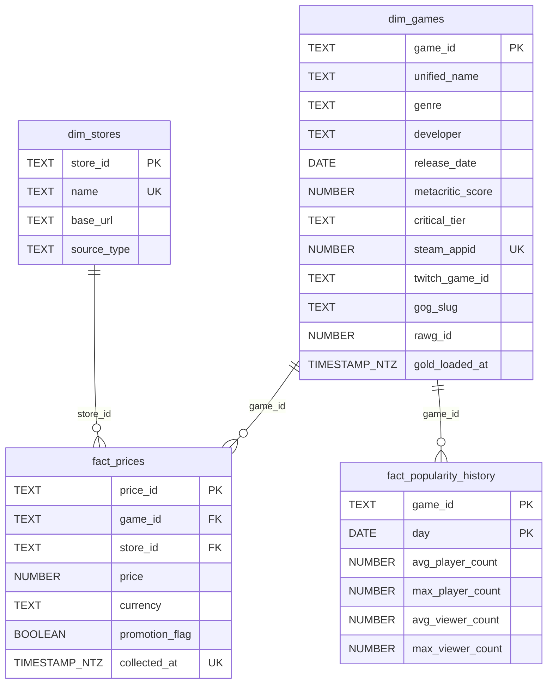

# Schema de donnees, couche Gold

> **Fichier genere. Ne pas modifier a la main.**
> Colonnes, types et contraintes lus dans le catalogue Snowflake ;
> cibles des clefs etrangeres lues dans `sql/schema_gold_snowflake.sql`,
> les deux sources etant recoupees a chaque generation.
> Regenerer par `python outils/generer_schema.py`.

Livrable du critere **C4.2.1**, qui demande un schema permettant
d'identifier le type des donnees, les modalites d'acces et l'organisation
des donnees. Les trois sections ci-dessous repondent dans cet ordre.

## 1. Organisation des donnees

Modele en etoile : deux dimensions, deux tables de faits, une vue de
restitution. Le grain de `fact_popularity_history` est le couple
(jeu, jour) ; celui de `fact_prices` est (jeu, boutique, instant de
collecte). Colonnes larges plutot qu'un modele entite-attribut-valeur :
les indicateurs suivis sont connus et peu nombreux.

S'y ajoute la vue `mart.v_popularity_dashboard`, seul objet visible du
role de restitution. Elle joint la dimension des jeux et les faits de
popularite, sans exposer les tables sous-jacentes.

## 2. Type des donnees

Types tels que le catalogue les porte. Le dimensionnement exact
(longueurs, precisions) figure dans `dictionnaire_gold_snowflake.md`,
qui est l'annexe faite pour cela.

### `mart.v_popularity_dashboard` (vue)

| Colonne | Type | Nul |
|---|---|---|
| `game_id` | `TEXT` | non |
| `unified_name` | `TEXT` | non |
| `genre` | `TEXT` | oui |
| `critical_tier` | `TEXT` | oui |
| `day` | `DATE` | non |
| `avg_player_count` | `NUMBER` | oui |
| `avg_viewer_count` | `NUMBER` | oui |

### `mart.dim_games` (table)

| Colonne | Type | Nul |
|---|---|---|
| `game_id` | `TEXT` | non |
| `unified_name` | `TEXT` | non |
| `genre` | `TEXT` | oui |
| `developer` | `TEXT` | oui |
| `release_date` | `DATE` | oui |
| `metacritic_score` | `NUMBER` | oui |
| `critical_tier` | `TEXT` | oui |
| `steam_appid` | `NUMBER` | oui |
| `twitch_game_id` | `TEXT` | oui |
| `gog_slug` | `TEXT` | oui |
| `rawg_id` | `NUMBER` | oui |
| `gold_loaded_at` | `TIMESTAMP_NTZ` | non |

### `mart.dim_stores` (table)

| Colonne | Type | Nul |
|---|---|---|
| `store_id` | `TEXT` | non |
| `name` | `TEXT` | non |
| `base_url` | `TEXT` | oui |
| `source_type` | `TEXT` | non |

### `mart.fact_popularity_history` (table)

| Colonne | Type | Nul |
|---|---|---|
| `game_id` | `TEXT` | non |
| `day` | `DATE` | non |
| `avg_player_count` | `NUMBER` | oui |
| `max_player_count` | `NUMBER` | oui |
| `avg_viewer_count` | `NUMBER` | oui |
| `max_viewer_count` | `NUMBER` | oui |

### `mart.fact_prices` (table)

| Colonne | Type | Nul |
|---|---|---|
| `price_id` | `TEXT` | non |
| `game_id` | `TEXT` | non |
| `store_id` | `TEXT` | non |
| `price` | `NUMBER` | non |
| `currency` | `TEXT` | non |
| `promotion_flag` | `BOOLEAN` | non |
| `collected_at` | `TIMESTAMP_NTZ` | non |

## 3. Modalites d'acces

| Objet | Role | Privilege |
|---|---|---|
| `mart.dim_games` | `gamelens_analyst` | `SELECT` |
| `mart.dim_games` | `gamelens_etl_service` | `INSERT` |
| `mart.dim_games` | `gamelens_etl_service` | `SELECT` |
| `mart.dim_games` | `gamelens_etl_service` | `UPDATE` |
| `mart.dim_stores` | `gamelens_analyst` | `SELECT` |
| `mart.dim_stores` | `gamelens_etl_service` | `INSERT` |
| `mart.dim_stores` | `gamelens_etl_service` | `SELECT` |
| `mart.dim_stores` | `gamelens_etl_service` | `UPDATE` |
| `mart.fact_popularity_history` | `gamelens_analyst` | `SELECT` |
| `mart.fact_popularity_history` | `gamelens_etl_service` | `INSERT` |
| `mart.fact_popularity_history` | `gamelens_etl_service` | `SELECT` |
| `mart.fact_popularity_history` | `gamelens_etl_service` | `UPDATE` |
| `mart.fact_prices` | `gamelens_analyst` | `SELECT` |
| `mart.fact_prices` | `gamelens_etl_service` | `INSERT` |
| `mart.fact_prices` | `gamelens_etl_service` | `SELECT` |
| `mart.fact_prices` | `gamelens_etl_service` | `UPDATE` |
| `mart.v_popularity_dashboard` | `gamelens_dashboard_viewer` | `SELECT` |

## 4. Ce que le moteur applique, et ce qu'il n'applique pas

Le catalogue declare les contraintes ci-dessous. **Snowflake ne les
applique pas a l'ecriture**, a l'exception de celles portees par la
colonne elle-meme (`NOT NULL`, type, longueur). `CHECK`, `FOREIGN KEY`,
`PRIMARY KEY` et `UNIQUE` sont des metadonnees, verifiees empiriquement
par `sql/verify_snowflake_constraints.sql`.

| Table | Contrainte declaree | Nombre |
|---|---|---|
| `mart.dim_games` | PRIMARY KEY | 1 |
| `mart.dim_games` | UNIQUE | 1 |
| `mart.dim_stores` | PRIMARY KEY | 1 |
| `mart.dim_stores` | UNIQUE | 1 |
| `mart.fact_popularity_history` | FOREIGN KEY | 1 |
| `mart.fact_popularity_history` | PRIMARY KEY | 1 |
| `mart.fact_prices` | FOREIGN KEY | 2 |
| `mart.fact_prices` | PRIMARY KEY | 1 |
| `mart.fact_prices` | UNIQUE | 1 |

Le diagramme ci-dessus montre donc des relations **voulues**, pas des
relations garanties par le moteur. Ce que le moteur ne garantit pas est
porte par deux filets rejoues a chaque push : les contrats declaratifs de
`dbt/models/gold/`, ou chaque `relationships` est exactement une des
fleches de ce diagramme, et les controles applicatifs de
`entrepot/verifier_gold.py`.
